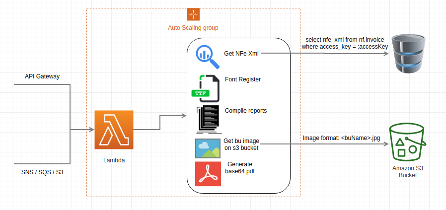

# Lambda NF PDF Generator #
Lambda será responsável por conectar ao banco de NF, buscar o xml com base na 'Chave de Acesso' e converte-lo para um PDF retornado em base64.
Internamente, o report utiliza o logo da empresa, sendo assim, estamos recebendo via header 'bu' o nome da empresa, que posteriormente será filtrado no S3Bucket pelo mesmo nome.


Environment variables:
```
LOGO_BUCKET_NAME=customer-logos
DATASOURCE_URL=jdbc:postgresql://nf-db:5432/nf
DATASOURCE_USERNAME=root
DATASOURCE_PASSWORD=123456
```
# Novos logos #
Novos logos que venham a ser considerados, devem conter a seguinte nomenclatura no nome '<bu>.jpg' e estar disponível no bucket para leitura.

# Funcionamento #

